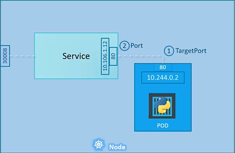
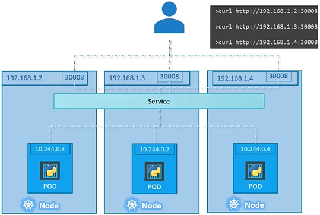

# CORE CONCEPTS

## ETCD

Key-Value Store per sistemi distribuiti. Contiene informazioni su Nodi, Pods, Segreti, Ruoli ecc. Tutte le informazioni richiamate da `kubectl get` arrivano dall'ETCD Server, come anche tutte le informazioni lette dall'API Server per conoscere lo stato del cluster.

Leggere e scrivere:

```bash
./etcdctl set key1 value1
./etcdctl get key1
```

Elenco di tutte le chiavi presenti:

```bash
etcdctl get / --prefix -keys-only
```

* ### Versione API ETCD

Ci sono due versioni supportate delle API di `etcd`, la versione 2 e 3. È necessario impostare correttamente la versione nelle variabili d'ambiente essendo i comandi molto diversi tra di loro.
Per impostare la versione:

```bash
export ETCDCTL_API=3
```

```bash
# Versione 2
etcdctl backup
etcdctl cluster-health
etcdctl mk
etcdctl mkdir
etcdctl set

# Versione 3
etcdctl snapshot save 
etcdctl endpoint health
etcdctl get
etcdctl put
```

*Nota*: se nessuna versione è specificata, verrà presa come default la versione 2.

* ### Installazione da zero

Installazione ed esecuzione:

```bash
wget -q --https-only "https://github.com/etcd-io/etcd/releases/download/v3.3.11/etcd-v3.3.11-linux-amd64.tar.gz"
tar xvzf etcd-v3.3.11-linux-amd64.tar.gz
./etcd
```

Configurare ed aggiornare etcd: <https://kubernetes.io/docs/tasks/administer-cluster/configure-upgrade-etcd/>

Le opzioni più importanti per la configurazione sono:

```bash
# Url a cui è raggiungibile etcd
--advertise-client-urls https://${INTERNAL_IP}:2379
```

* ### Installazione con kubeadm

`kubeadm` istanzia un Pod che esegue `etcd` nel namespace `kube-system`.
Il Pod si chiamerà `etcd-master` e si può vedere chiamando:

```bash
kubectl get pods -n kube-system
```

I comandi posso essere inviati al Pod con:

```bash
kubectl exec etcd-master -n kube-system etcdctl <comando>
```

* ### ETCD Cluster

Per configurare un cluster di `etcd` è necessario impostare i seguenti parametri:

```bash
# Url delle varie istanze etcd nel cluster
--initial-cluster controller-0=https://${CONTROLLER_IP}:2380,controller-1=https://${CONTROLLER_IP}:2380,#...
```

*Nota*: la porta 2380 è per la comunicazione tra `etcd` e `etcd`, mentre la porta 2379 è tra `client` ed `etcd`.

## Kube-API Server

È la componente principale di Kubernetes. Si occupa di autenticare e validare le richieste, scaricare e aggiornare i dati nell'ETCD (ed è l'unico servizio a poterlo fare). Può comandare i `kubelet` e viene utilizzato da altri servizi per conoscere lo stato del cluster e agire di conseguenza, sempre richiedendo l'azione all'API server.
Ogni comando inviato via `kubectl` passa dal Kube-API Server. Le sue API possono anche essere richiamate con una classica chiamata GET e POST via API REST.

* ### Installazione di Kube-API Server da zero

Installazione:

```bash
wget https://storage.googleapis.com/kubernetes-release/release/v1.13.0/bin/linux/amd64/kube-apiserver
```

Le opzioni più importanti per la configurazione sono:

```bash
# Elenco dei server ETCD
--etcd-servers=https://${CONTROLLER_IP}:2379,https://${CONTROLLER_IP}:2379,#...
```

ed inoltre altre impostazioni varie per i certificati SSL.
La configurazione attuale dell'API Server è visibile col comando:

```bash
cat /etc/systemd/system/kube-apiserver.service
```

* ### Installazione di Kube-API Server con kubeadm

`kubeadm` istanzia un Pod che esegue `kube-apiserver` nel namespace `kube-system`.
Il Pod si chiamerà `kube-apiserver-master` e si può vedere chiamando:

```bash
kubectl get pods -n kube-system
```

Le specifiche del Pod che contiene l'API Server sono presenti in `/etc/kubernetes/manifests/kube-apiserver.yaml`.

## Kube Controller Manager

Gestisce vari controller, che monitorano lo stato dei componenti del sistema e cercano di mantenere sempre il sistema allo stato desiderato. I controller ottengono lo stato dei componenti ed eseguono le azioni passando sempre attraverso l'API Server.

* ### Installazione di Kube Controller Manager da zero

Installazione:

```bash
wget https://storage.googleapis.com/kubernetes-release/release/v1.13.0/bin/linux/amd64/kube-controller-manager
```

Le opzioni più importanti per la configurazione sono:

```bash
# Ogni quanti secondi viene verificato lo stato dei nodi
--node-monitor-period=5s
# Dopo quanti secondi un nodo viene considerato unreachable se l'health check fallisce
--node-monitor-grace-period=40s
# Tempo lasciato al Pod per tornare operativo prima che venga rimpiazzato
--pod-eviction-timeout=5m0s
# Elenco dei controller abilitati. Di default sono tutti abilitati. È consigliato tenerli sempre tutti abilitati
--controllers * # foo per abilitare, -foo per disabilitare
```

La configurazione attuale del Kube Controller Manager è visibile col comando:

```bash
cat /etc/systemd/system/kube-controller-manager.service
```

* ### Installazione di Kube Controller Manager con kubeadm

`kubeadm` istanzia un Pod che esegue `kube-controller-manager` nel namespace `kube-system`.
Il Pod si chiamerà `kube-controller-manager-master` e si può vedere chiamando:

```bash
kubectl get pods -n kube-system
```

Le specifiche del Pod che contiene il Controller Manager sono presenti in `/etc/kubernetes/manifests/kube-controller-manager.yaml`.

## Kube Scheduler

Decide a che Nodo assegnare i Pod, in funzione delle risorse richieste, risorse disponibili ecc. con l'aiuto di una funzione che permette di scegliere il Nodo compatibile migliore.
È possibile sviluppare ed utilizzare uno Scheduler personalizzato.

* ### Installazione di Kube Scheduler da zero

Installazione:

```bash
wget https://storage.googleapis.com/kubernetes-release/release/v1.13.0/bin/linux/amd64/kube-scheduler
```

Le opzioni più importanti per la configurazione sono:

```bash
# Path della configurazione dello scheduler
--config=path/to/kube-scheduler.yaml
```

La configurazione attuale del Kube Scheduler è visibile col comando:

```bash
cat /etc/systemd/system/kube-scheduler.service
```

* ### Installazione di Kube Scheduler con kubeadm

`kubeadm` istanzia un Pod che esegue `kube-scheduler` nel namespace `kube-system`.
Il Pod si chiamerà `kube-scheduler-master` e si può vedere chiamando:

```bash
kubectl get pods -n kube-system
```

Le specifiche del Pod che contiene lo Scheduler sono presenti in `/etc/kubernetes/manifests/kube-scheduler.yaml`.

## Kubelet

Gestisce le operazioni nei Nodi, come la registrazione dei Nodi nel Cluster, il deployment dei Pods all'interno del Nodo, l'invio dei report dello stato all'API Server.

* ### Installazione di Kubelet da zero

Installazione:

```bash
wget https://storage.googleapis.com/kubernetes-release/release/v1.13.0/bin/linux/amd64/kubelet
```

La configurazione attuale del Kube Scheduler è visibile col comando:

```bash
cat /etc/systemd/system/kubelet.service
```

* ### Installazione di Kubelet con kubeadm

`kubeadm` non installa `kubelet` nei nodi. È necessario sempre installare manualmente `kubelet`.

## Kube Proxy

Permette ai tutti i Pod di comunicare tra di loro. Ogni volta che un servizio viene creato, i Kube Proxy aggiornano le loro IP Table interne in modo da mettere in comunicazione i nodi definiti nel servizio, e di conseguenza i Pod contenuti nei nodi.

* ### Installazione di Kube Proxy da zero

Installazione:

```bash
wget https://storage.googleapis.com/kubernetes-release/release/v1.13.0/bin/linux/amd64/kube-proxy
```

La configurazione attuale del Kube Scheduler è visibile col comando:

```bash
cat /etc/systemd/system/kube-proxy.service
```

* ### Installazione di Kube Proxy con kubeadm

`kubeadm` istanzia un Pod per ogni nodo che esegue `kube-proxy` nel namespace `kube-system`.
Il Pod si chiamerà `kube-proxy-<id>` e si può vedere chiamando:

```bash
kubectl get pods -n kube-system
```

## Pods

Il Pod è il più piccolo oggetto presente in Kubernetes, e rappresenta una singola istanza dell'applicazione. Viene eseguito nei nodi del cluster, e può contenere uno o più container.
Kubernetes può istanziare vari Pod nello stesso nodo o in nodi diversi, in funzione del carico di lavoro e dello stato di funzionamento dei vari Pod.

Per vedere la lista dei Pod presenti nel cluster:

```bash
kubectl get pods
```

Per avere dettagli e informazioni varie sul Pod appena creato:

```bash
kubectl describe pod <nome_pod> # in questo caso sarebbe myapp-pod
```

### Deploy di un Pod da CLI

Un Pod può essere creato e deployato dal terminale eseguendo:

```bash
kubectl run <nome_pod> --image <path/to/docker_image>
```

e per cancellarlo:

```bash
kubectl delete <nome_pod>
```

### Deploy di un Pod da specifica YAML

La configurazione di base per il deploy di un Pod utilizzando uno *yaml* è:

```yaml
# pod-definition.yaml
apiVersion: v1
kind: Pod
metadata:
    name: myapp-pod
    labels:
        # qualsiasi key e value
        app: myapp
        type: front-end
        # ...
spec:
    containers:
      - name: nginx-container
        image: nginx # se non preso da Docker Hub, specifica l'url del registro
```

Per eseguire il deploy:

```bash
kubectl apply -f pod-definition.yaml
# oppure
kubectl create -f pod-definition.yaml # create va in errore se il Pod esiste già
```

## Replica Sets

Il Replication Controller controlla che il numero desiderato di Pod sia in esecuzione nel cluster. Si occupa di sostituire i Pod in errore e crearne di nuovi per mantenere lo stato del cluster desiderato.
Il Replication Controller è in realtà la vecchia implementazione del controller, mentre il nuovo si chiama Replica Set.

Per vedere i Replication Controller in esecuzione:

```bash
kubectl get replicationcontroller
```

mentre per i ReplicaSet:

```bash
kubectl get replicaset
```

### Deploy di un Replication Controller da specifica YAML

La configurazione di base per il deploy di un Replication Controller utilizzando uno *yaml* è:

```yaml
# rc-definition.yaml
apiVersion: v1
kind: ReplicationController
metadata:
    name: myapp-rc
    labels:
        app: myapp
        type: front-end
spec:
    replicas: 3
    template:
    ### POD DEFINITION ###
        metadata:
        name: myapp-pod
        labels:
            app: myapp
            type: front-end
        spec:
            containers:
            - name: nginx-container
                image: nginx
    ######################
```

Per eseguire il deploy:

```bash
kubectl apply -f rc-definition.yaml
```

### Deploy di un ReplicaSet da specifica YAML

La configurazione di base per il deploy di un ReplicaSet utilizzando uno *yaml* è:

```yaml
# replicaset-definition.yaml
apiVersion: apps/v1
kind: ReplicaSet
metadata:
    name: myapp-replicaset
    labels:
        app: myapp
        type: front-end
spec:
    replicas: 3
    selector: 
        matchLabels:
            type: front-end
    template:
    ### POD DEFINITION ###
        metadata:
        name: myapp-pod
        labels:
            app: myapp
            type: front-end
        spec:
            containers:
            - name: nginx-container
              image: nginx
    ######################
```

La differenza principale tra ReplicaSet e Replication Controller è la presenza dei `selector`. Il tag `selector` permette di selezionare quali Pod il ReplicaSet deve gestire, oltre a quelli definiti nello *yaml*. È utile per controllare Pod che sono già in esecuzione nel cluster.
In realtà anche Replication Controller permette di inserire la tag `selector`, che però è facoltativa e assume di default i valori presenti sul tag `labels`. Inoltre nel Replication Controller non è possibile usare `matchExpression`.

Per eseguire il deploy:

```bash
kubectl apply -f replicaset-definition.yaml
```

### Scaling di un ReplicaSet

Ci sono due modi per aumentare (o diminuire) le repliche di un Pod. È possibile modificare il file *yaml* e deployarlo:

```bash
kubectl replace -f replicaset-definition.yaml
# oppure
kubectl apply -f replicaset-definition.yaml
```

In alternativa è possibile usare il comando `scale`:

```bash
kubectl scale --replicas=6 -f replicaset-definition.yaml
```

che andrà anche ad aggiornare automaticamente il file.
Se non si conosce la posizione del file *yaml*, è possibile scalare anche con:

```bash
kubectl scale --replicas=6 replicaset <nome_replicaset>
```

*Nota*: questo comando non aggiorna il file *yaml* ma esegue direttamente lo scaling in runtime.

## Deployments

Un Deployment permette di eseguire varie repliche di un Pod, come un ReplicaSet. Ha però anche molte funzionalità in più, come ad esempio la possibilità di aggiornare facilmente le immagini dei container facendo dei *rollout* e dei *rollback* in caso di errore. Il Deployment è l'oggetto principale per eseguire Pods di applicazioni __Stateless__.
Un Deployment crea automaticamente il suo ReplicaSet, e il ReplicaSet crea poi i Pod. Per vedere tutti gli oggetti creati da Kubernetes:

```bash
kubectl get all
```

mentre per vedere solo i deployment:

```bash
kubectl get deployments
```

### Deploy di un Deployment da specifica YAML

La configurazione di un Deployment è:

```yaml
# deployment-definition.yaml
apiVersion: apps/v1
kind: Deployment
metadata:
    name: myapp-deployment
    labels:
        app: myapp
        type: front-end
spec:
    replicas: 3
    selector: 
        matchLabels:
            type: front-end
    template:
    ### POD DEFINITION ###
        metadata:
        name: myapp-pod
        labels:
            app: myapp
            type: front-end
        spec:
            containers:
            - name: nginx-container
              image: nginx
    ######################
```

Come si nota è molto simile al ReplicaSet.
Per eseguire il deploy:

```bash
kubectl apply -f deployment-definition.yaml
```

### Generare un file YAML con Dry Run

Potrebbe essere complicato creare da zero un file *yaml* da terminale. È possibile però auto generare le specifiche *yaml* eseguendo una `dry-run` con `kubectl create`, ad esempio:

```bash
kubectl create deployment --image=nginx nginx --dry-run=client -o yaml > nginx-deployment.yaml
```

## Services

Permette di connettere i Pod tra di loro e con l'esterno.

Per vedere i servizi in esecuzione nel cluster:

```bash
kubectl get services
```

### NodePort

Mappa una porta del Nodo ad una porta del Pod. In questo modo le richieste inviate dall'esterno all'IP e porta del nodo vengonono indirizzate al servizio in esecuzione nel Pod. Il servizio viene lanciato all'interno del cluster come un server virtuale con un suo IP interno.

Le porte da configurare nel servizio sono tre:

* TargetPort: la porta del Pod a cui reindirizzare le richieste.
* Port: la porta del servizio da cui provengono le richieste inviate al Pod.
* NodePort: La porta del Nodo che ricevere le richieste dall'esterno. La porta del Nodo deve essere compresa tra 30000 e 32767.



La configurazione di un Service NodePort:

```yaml
# service-definition.yaml
apiVersion: v1
kind: Service
metadata:
    name: myapp-service
spec:
    type: NodePort
    ports:
      - targetPort: 80 # facoltativo, di default è uguale a port
        port: 80
        nodePort: 30008 # facoltativo, di defeault viene assegnata una porta casuale nel range 30000 e 32767
    selector:
        app: myapp
        type: front-end
```

I Pod a cui il servizio invia le richieste viene selezionato tramite i `selector`. Verranno selezionati solo i Pod che hanno __tutti__ i label corrispondenti (sia chiave che valore).
Per creare il servizio:

```bash
kubectl apply -f service-definition.yaml
```

Ora è possibile ricevere una risposta dal servizio all'interno del nodo chiamando l'indirizzo pubblico del nodo alla porta 30008. Se sono presenti più Pod corrispondenti ai `labels` scelti, il servizio li prenderà in carico tutti automaticamente inviando ogni volta la richiesta casualmente ad uno di essi (come un Load Balancer).

Se i Pod corrispondenti sono presenti in nodi diversi, viene creato automaticamente un servizio che copre tutti i nodi necessari, e i Pod diventano raggiungibili facendo una richiesta a qualsiasi degli IP esterni dei nodi selezionati, alla porta NodePort impostata.



### ClusterIP

Il servizio crea un indirizzo virtuale visibile solo all'interno del Cluster. Questo permette la connessione tra Pod all'interno del cluster, senza esporli all'esterno.

### LoadBalancer

Distribuisce il traffico proveniente dall'esterno ai vari Pod.

## References

1. [CKA Course - Core Concepts](https://github.com/kodekloudhub/certified-kubernetes-administrator-course/tree/master/docs/02-Core-Concepts)
2. [Kubernetes Documentation - Getting Started](https://kubernetes.io/docs/setup/)
3. [Kubernetes Documentation - Kubeadm Install](https://kubernetes.io/docs/setup/production-environment/tools/kubeadm/install-kubeadm/)
4. [kubectl Usage Conventions](https://kubernetes.io/docs/reference/kubectl/conventions/)
5. [etcd.io](https://etcd.io/docs/)
